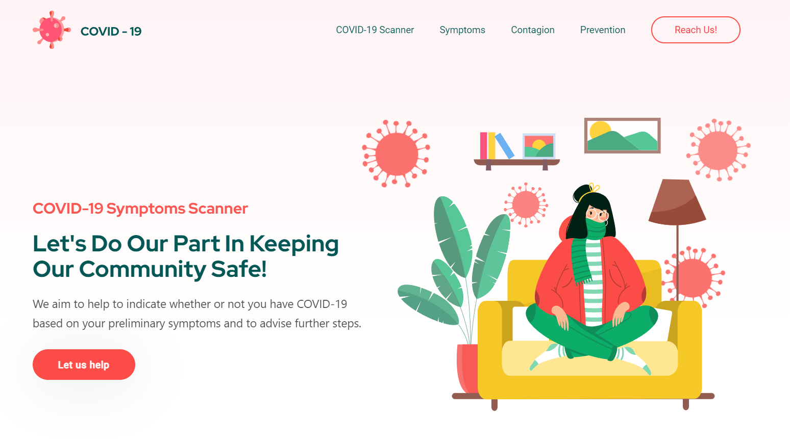
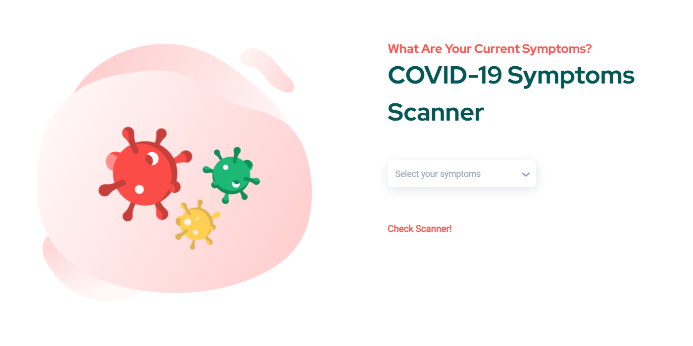
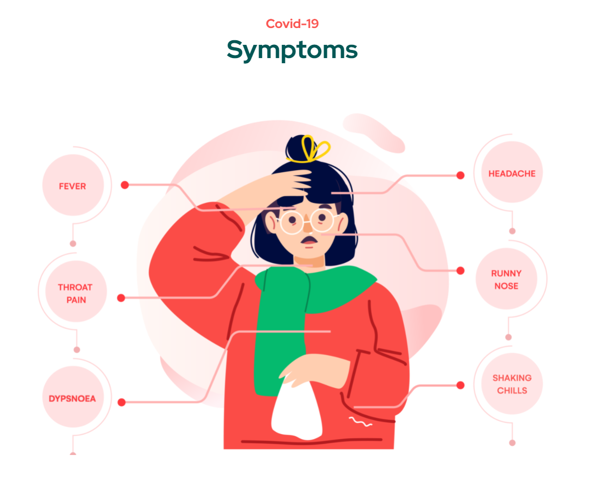
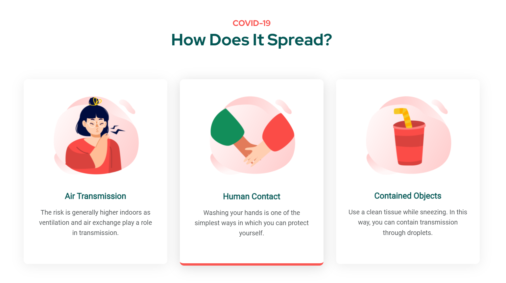

# 2D Project DDW Bonus WebApp

SC03 Group 9
- Kaveri Priya Putti
- Mah Yi Da
- Chen Jiasen
- Jolin Teo Hui Lyn

All group members contributed equally to this project. :)

### Visuals of our WebApp










### Setup of the WebApp

Take note of the following directions to run our WebApp on Vocareum.

If you use Vocareum terminal to run our Flask application, you can do so by running the runflaskvoc.sh script. Before running this script, we need to make sure the `voc=True` is set to true in the following line inside `work/webapp_2d/app.py`.

```python
application.wsgi_app = PrefixMiddleware(application.wsgi_app, voc=True)
```

Use `cd` to navigate to the `webapp_2d` folder

```shell
> cd webapp_2d
```

Now, make sure you are inside the `webapp_2d` folder by using the `pwd` command. 

```shell
> pwd
```

Make sure that the script is executable by running the following command. 

```shell
> chmod a+x ./runflaskvoc.sh
```
The above script is to change the file to be executable for all users, group and owner.

To run the script, type the following.

```shell
> ./runflaskvoc.sh
```

Once it is running, you can open another tab in your browser and type the following url: [`https://myserver.vocareum.com/`](https://myserver.vocareum.com/).

To stop the web app type `CTRL+C`. 

### Downloading the Repository to Run Locally

Clone the project repository from this GitHub repository. On your terminal or Git Bash, type the following:
```shell
$ https://github.com/kaveripriyap/webapp-symptoms-scanner-covid19.git
```

## Create a Virtual Environment on your Local Computer (MacOS/Linux)

Go to the root folder `webapp-symptoms-scanner-covid19`.

```shell
$ cd ~/Downloads/webapp-symptoms-scanner-covid19
```
From the root folder, create a virtual environment called `virtenv`.
```shell
$ python -m venv virtenv
```
A folder called virtenv will be created and now, we can activate the virtual environment with the following command.

```shell
$ source virtenv/bin/activate
```
You should see the word virtenv displayed on your prompt in a fashion similar to:

```shell
(virtenv) user$
```

To exit the virtual environment at the end of this project, simply type the following command.

```shell
$ deactivate
```

## Create a Virtual Environment on your Local Computer (Windows)

Go to the root folder  `webapp-symptoms-scanner-covid19`.

```shell
> cd Downloads\ webapp-symptoms-scanner-covid19
```

From the root folder, create a virtual environment called `virtenv`.

```shell
> python -m venv virtenv
```

A folder called virtenv will be created and now, we can activate the virtual environment with the following command.

```shell
> virtenv\Scripts\activate
```

You should see the word virtenv displayed on your prompt in a fashion similar to:

```shell
(virtenv) folder>
```

To exit the virtual environment at the end of this project, simply type:

```shell
> deactivate
```

## Combined Set-Up Instructions (Windows/MacOS/Linux)

Install the necessary packages for this webapp to run from the root folder `webapp-symptoms-scanner-covid19` and type the following:

For Windows:

```shell
> python -m pip install -U --force-reinstall -r requirements.txt
```

For MacOS/Linux: (For Linux, you might need to type in pip3 instead)
```shell
$ python -m pip install -U --force-reinstall -r requirements.txt
```

The above steps will install Flask and other necessary packages in `requirements.txt`.

Make sure you're inside the `webapp-symptoms-scanner-covid19` folder by using the `pwd` command.

```shell
> pwd
```

If you're not in the `webapp-symptoms-scanner-covid19` folder, make sure to navigate back to the `webapp-symptoms-scanner-covid19` folder.

You can now run Flask by typing the following command.
```shell
$ flask run
```

You should see the following lines in some of the output that's displayed after running the above command.
```shell
* Running on http://127.0.0.1:5000/ (Press CTRL+C to quit)
```

Now you can open your browser and paste http://127.0.0.1:5000/ to view our WebApp.
